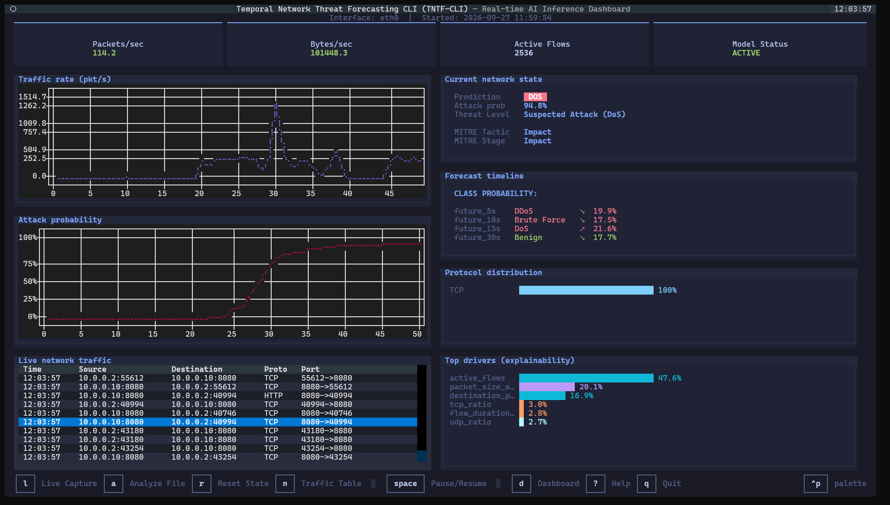
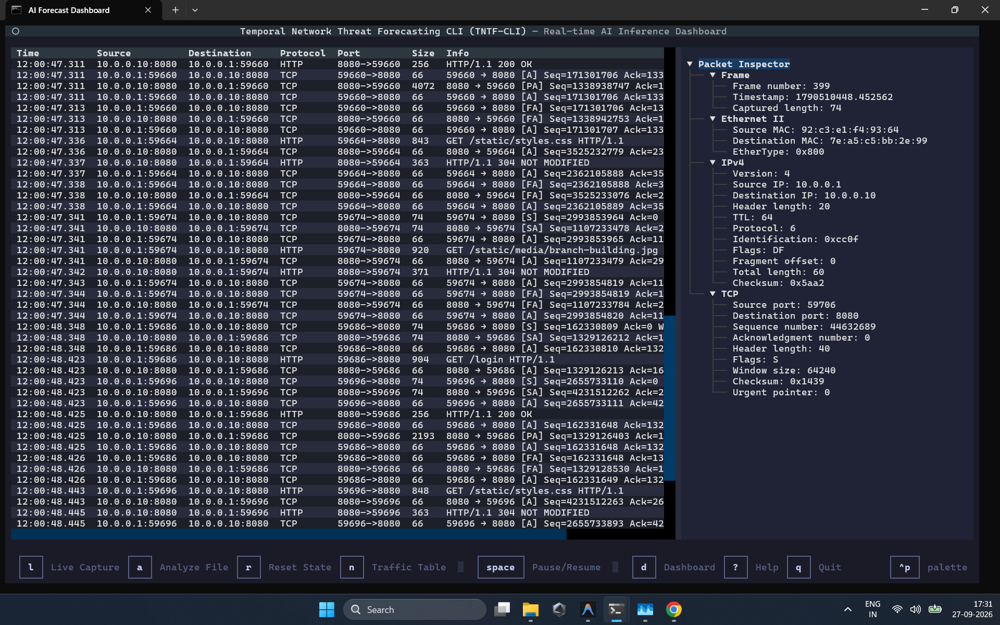
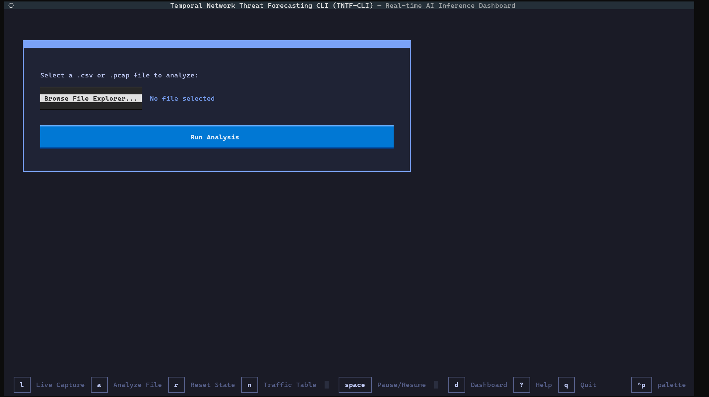

# TNTF-CLI: Temporal Network Threat Forecasting


*TNTF-CLI Real-time Dashboard Monitoring Network Traffic*

**TNTF-CLI** is an advanced network threat detection and forecasting framework built around a PyTorch **Temporal Transformer**. By aggregating network traffic into discrete 1-second state vectors and processing 60-second historical sequences, the model predicts both the **current threat class** and extrapolates probabilities for **future threat horizons** (up to 60 seconds into the future).

---

## Contents
- [System Architecture](#system-architecture)
- [Key Features](#key-features)
- [Installation (Local)](#installation-local)
- [Docker Network Testing Lab](#docker-network-testing-lab)
- [Dataset & Data Processing](#dataset--data-processing)
- [Model Training & Evaluation](#model-training--evaluation)
- [Model Performance Results](#model-performance-results)
- [Live Inference & Custom PCAP Analysis](#live-inference--custom-pcap-analysis)
- [Project Structure](#project-structure)
- [Troubleshooting](#troubleshooting)

---

## System Architecture


*End-to-end architecture from dataset ingestion to real-time forecasting.*


*Temporal state compilation and multi-horizon forecasting logic.*

The v6 architecture converts raw traffic flows into continuous **1-second states** (15 features). The most recent 60 states are passed to the Temporal Transformer to predict:
- `now`: The immediate threat classification.
- `future_5s`, `future_10s`, `future_15s`, `future_30s`, `future_60s`: Forecasted class probabilities.

---

## Key Features
- **Temporal Transformer**: Sequence-to-sequence multi-horizon threat forecasting.
- **Lightweight State Representation**: 15 highly optimized network flow features per second.
- **Live Terminal UI**: High-performance Textual dashboard displaying traffic, active flows, and predictions.
- **Isolated Docker Lab**: Secure, containerized environment with target applications and attack tools.
- **PCAP Support**: Analyze offline packet captures visually in the dashboard.

---

## Installation (Local)

**Requirements**: Python 3.10+, `pip`, and `libpcap` (or Npcap on Windows).

**Linux / macOS**
```bash
git clone https://github.com/pramod-shinde-05/TNTF-CLI.git
cd TNTF-CLI
python3 -m venv venv
source venv/bin/activate
pip install -r project/requirements.txt
```

**Windows**
```cmd
git clone https://github.com/pramod-shinde-05/TNTF-CLI.git
cd TNTF-CLI
python -m venv venv
.\venv\Scripts\activate
pip install -r project\requirements.txt
```

---

## Docker Network Testing Lab


*Topology of the Docker-isolated testing environment.*

The repository includes a closed-loop network to safely simulate attacks. 
### Containers
- `testing-app`: A Flask target application running on port `8080`.
- `forecast`: The ML sidecar running TNTF-CLI. It uses `network_mode: "service:testing-app"`, allowing it to natively monitor the target's `eth0` interface.
- `attacker`: A dedicated node preloaded with attack tools (`hping3`, `slowloris`).

### Starting the Lab
Run the automated startup scripts. Docker Compose will build the network and spawn two interactive windows automatically:
- **Linux/macOS**: `./start_lab.sh`
- **Windows**: `start_lab.bat`

### Accessing Containers Manually
If you need to enter the containers directly:
- **Forecast Dashboard**: `docker exec -it forecast bash -c "python3 network_traffic_collector/main.py --ml"`
- **Attacker Menu**: `docker exec -it attacker bash /scripts/attack_menu.sh`
- **Testing App Shell**: `docker exec -it testing-app bash`

### Lab Usage
Use the **Attacker Menu** window to launch attacks (e.g., DoS Hulk, GoldenEye) against the `testing-app`. Monitor the **Forecast Dashboard** window to watch the model detect the threat and forecast its continuation in real time.

---

## Dataset & Data Processing

The model trains on the **CIC-IDS2018** dataset. 

1. **Download Raw Data:**
   ```bash
   cd dataset
   aws s3 sync --no-sign-request --region ca-central-1 "s3://cse-cic-ids2018/Processed Traffic Data for ML Algorithms/" .
   cd ..
   ```
2. **Execute Processing Pipeline:**
   This pipeline cleans the data, engineers the 15 features, builds 1-second state aggregations, and rolls them into 60-state sequences saved as numpy tensors.
   ```bash
   ./run_dataset_pipeline.sh
   ```

---

## Model Training & Evaluation

### Training
```bash
cd project
PYTHONPATH=. python models/temporal_transformer/train_v6.py
```
*Model weights and metadata are saved to `project/models/temporal_transformer/artifacts_v6/`.*

### Evaluation
```bash
cd project
PYTHONPATH=. python evaluation/evaluate.py
```
*Generates JSON metrics, F1 bar plots, confusion matrices, and calibration curves in `project/models/temporal_transformer/evaluation/`.*

---

## Model Performance Results

The following metrics were verified against the v6 Temporal Transformer test split evaluation.

**P1.8 Current Threat Performance (`now`)**
| Model | Precision | Recall | F1 Score | FPR |
| :--- | :---: | :---: | :---: | :---: |
| Temporal Transformer | 0.9721 | 0.9622 | 0.9671 | 0.0278 |

**P1.9 Multi-horizon Forecast Performance**
| Horizon | Precision | Recall | F1 Score | FPR |
| :--- | :---: | :---: | :---: | :---: |
| `now` | 0.9156 | 0.9824 | 0.9478 | 0.0908 |
| `future_5s` | 0.4328 | 0.7855 | 0.5581 | 0.9750 |
| `future_10s` | 0.4946 | 0.9011 | 0.6386 | 0.8669 |
| `future_15s` | 0.5117 | 0.9872 | 0.6740 | 0.8802 |
| `future_30s` | 0.4224 | 0.7676 | 0.5449 | 0.9673 |
| `future_60s` | 0.4804 | 0.9081 | 0.6284 | 0.8905 |

**P1.10 Early Warning Capabilities**
The model successfully identifies attack probability surges an average of **5.00 seconds** before the formalized onset of the threat within the temporal sequence.

---

## Live Inference & Custom PCAP Analysis


*Dashboard dynamically displaying class probabilities across forecast horizons.*

### Running Live Capture
To run the CLI on your host machine against a physical interface, update `project/network_traffic_collector/config.py` (e.g., `DEFAULT_INTERFACE = "eth0"`), then run:
```bash
cd project
sudo $(which python) network_traffic_collector/main.py --ml
```


*Network capture pane monitoring active and completed traffic flows.*

### Custom PCAP Analysis

*Analyzing an uploaded PCAP through the built-in UI.*

To inject custom `.pcap` files into the Docker AI environment for analysis:
- **Linux/macOS:** `./upload_to_forecast.sh`
- **Windows:** `upload_to_forecast.bat`

*These scripts automatically launch a native OS file-picker GUI. Select your file, and it will be securely copied into the running `forecast` container at `/home/`, ready to be selected in the dashboard's "Analyze File" menu.*

---

## Project Structure

```text
TNTF-CLI/
├── dataset/                     # Download target for raw CIC-IDS2018 CSVs
├── dataset_v2/                  # Compiled 1-sec states and 60-state numpy sequences
├── docker/                      # Dockerfile configurations and attack scripts
├── project/                     
│   ├── configs/                 # Architecture, feature schemas, and label mappings
│   ├── evaluation/              # Test split evaluation and visualization scripts
│   ├── models/                  
│   │   └── temporal_transformer/# PyTorch model definition and v6 artifacts
│   └── network_traffic_collector/ # Scapy sniffer, state tracking, and TUI
├── testing_app/                 # Flask target for Docker lab testing
├── upload_pcap/                 # Mount point for PCAP uploads
├── start_lab.*                  # Automated Docker environment startup
├── upload_to_forecast.*         # Automated PCAP injection GUI
└── README.md                    
```

---

## Troubleshooting

- **No Traffic in Dashboard**: If running locally, ensure you executed the script with `sudo` or Administrator privileges. In Docker, ensure the `forecast` container successfully attached to the `testing-app` namespace.
- **Docker Compose Port Conflicts**: If port `8080` is in use, modify the binding in `docker/docker-compose.yml` (`"8080:8080"`).
- **Missing State Dict Keys**: Ensure `models/temporal_transformer/artifacts_v6/` contains the correct weights for the `model.yaml` configuration. The v6 architecture specifically requires the 15-feature configuration and a 60-length sequence length.
